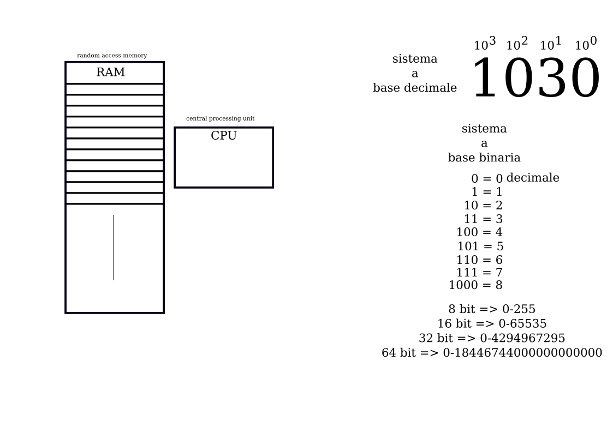

# Corso Propedeutico: lezione del 17/03/2020 (modalità remota)

## Argomenti trattati: **INFORMATICA**

### Introduzione all'informatica

* Le macchine di calcolo nella storia
* Turing
* Von Neumann
* Elementi *harware* di un elaboratore
* Il sistema binario
  * contare

## Lavagne

