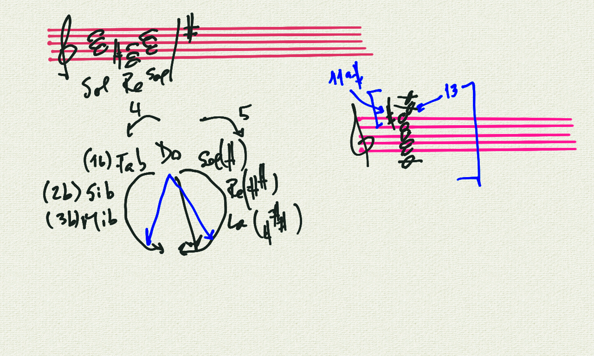

# Corso Propedeutico: lezione del 24/03/2020 (modalità remota)

## Argomenti trattati: **Tecniche Compositive della Musica Contemporanea**

### Armonia post-tonale e estesa

* Armonia non-funzionale
  * Relazione cromatica delle medianti (con estensioni)
  * Progressioni Cromatiche
  * Sequenze reali
  * Tonalità locali
  * Politonalità

## Lavagne

