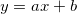
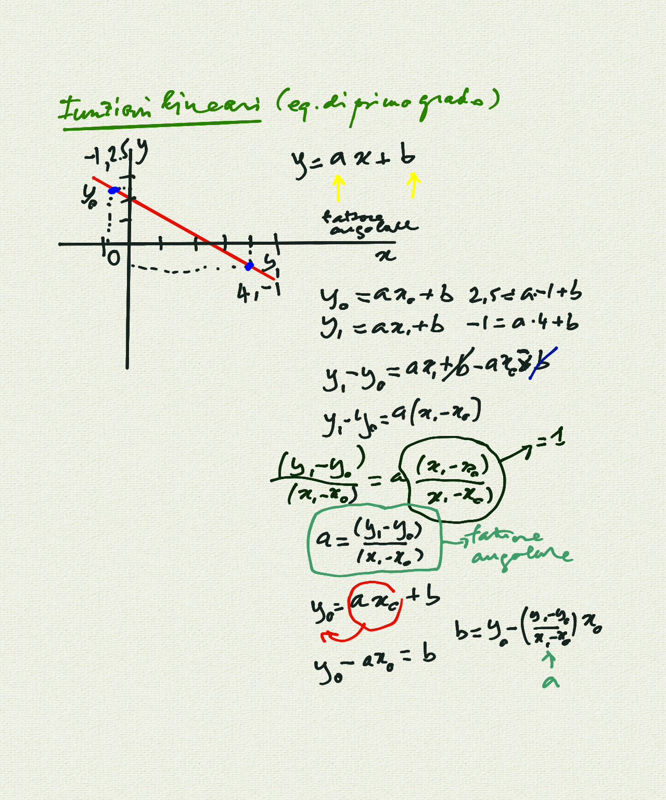
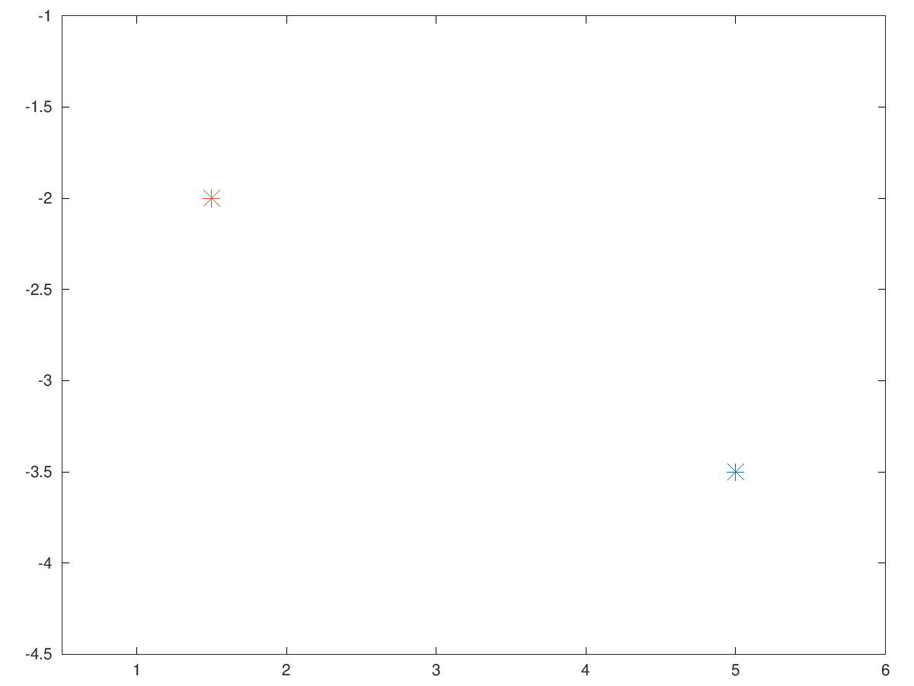
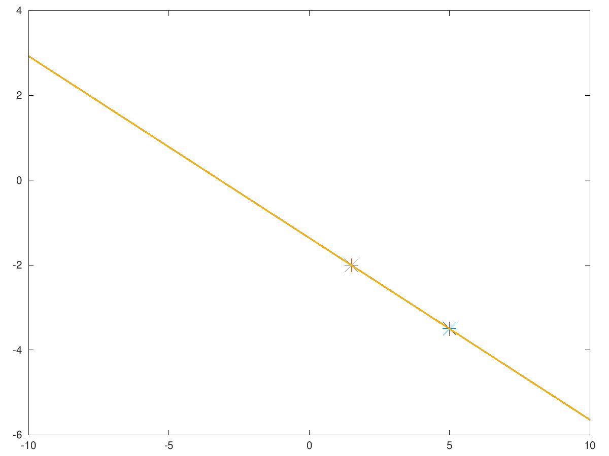

# Corso Propedeutico: lezione del 31/03/2020 (modalità remota)

## Argomenti trattati: **Elementi di Matematica**

### Soluzione di equazioni lineari (equazioni di primo grado)

* generalizzazione della funzione di primo grado di una retta 
* realizzazione alla lavagna
* realizzazione in linguaggio `matlab` con `octave`

#### Lavagne



#### [Esempio di Equazione lineare in `matlab` - Esempio 0](./linear0.m)

```matlab
%
% provare che le funzioni lineari effettivamente funzionano
%
y0 = -3.5;
x0 = 5;
y1 = -2;
x1 = 1.5;
%
% le funzioni lineari sono di tipo: y = a*x + b
%
a = (y1-y0)/(x1-x0);
b = y0 - (a*x0);

plot(x0, y0, "*", "markersize", 10, x1, y1, "*", "markersize", 10)
axis([x1-1 x0+1 y0-1 y1+1])
```

Questo codice, eseguito con `octave`, produce il grafico che segue:



#### [Esempio di Equazione lineare in `matlab` - Esempio 1](./linear1.m)

```matlab
%
% provare che le funzioni lineari effettivamente funzionano
%
y0 = -3.5;
x0 = 5;
y1 = -2;
x1 = 1.5;
%
% le funzioni lineari sono di tipo: y = a*x + b
%
a = (y1-y0)/(x1-x0);
b = y0 - (a*x0);

x = [-10:0.01:10];
y = (a*x) + b;

plot(x0, y0, "*", "markersize", 12, x1, y1, "*", "markersize", 12, x, y, "linewidth", 4)
```

Questo codice, eseguito con `octave`, produce il grafico che segue:


