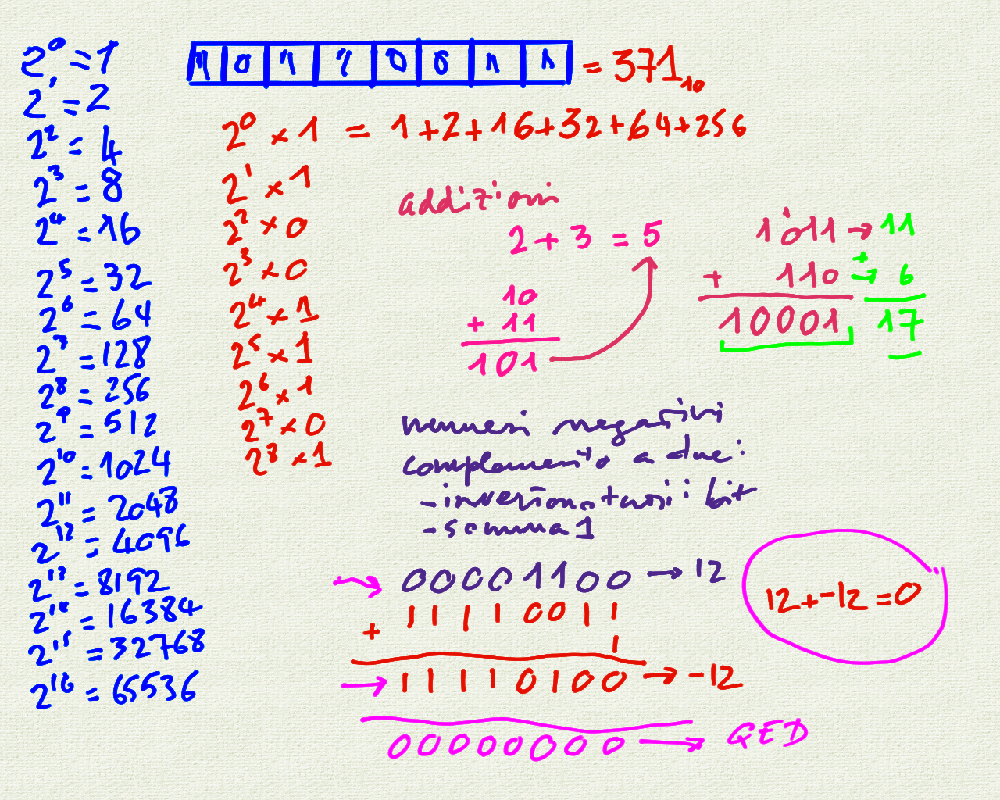
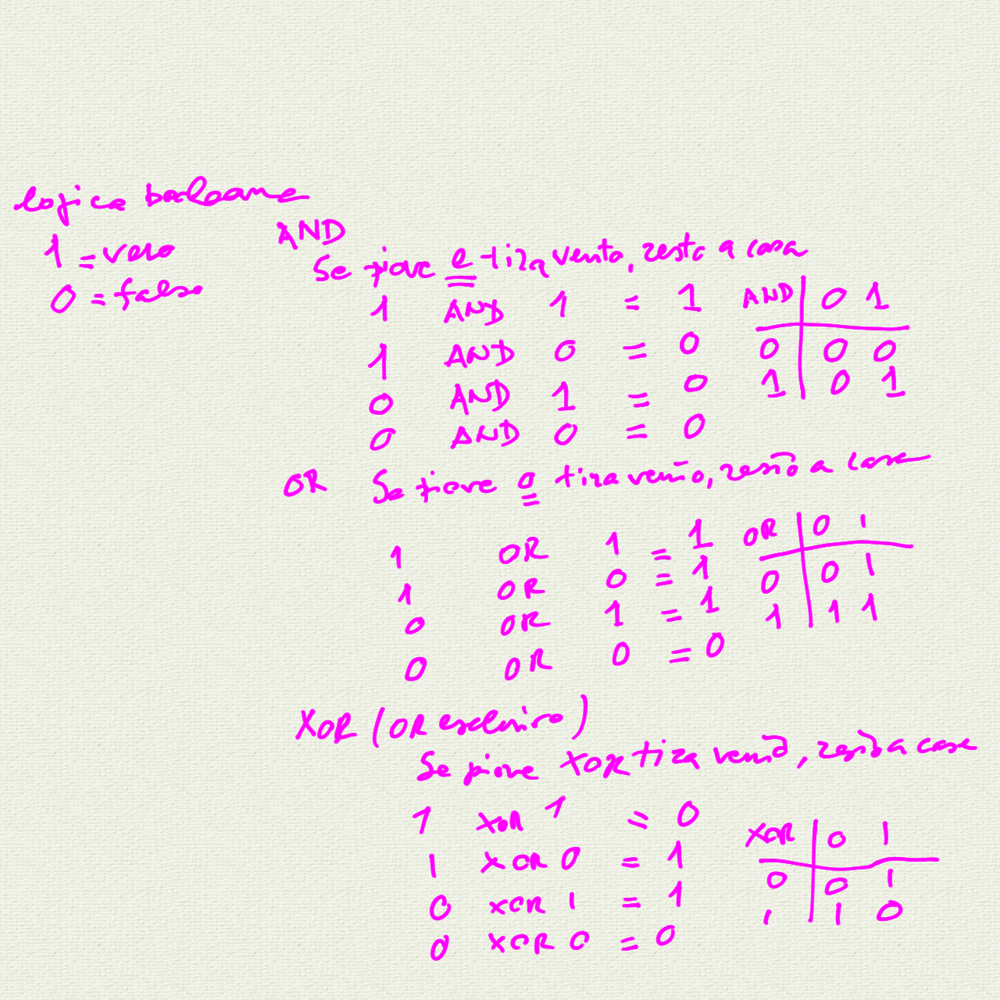
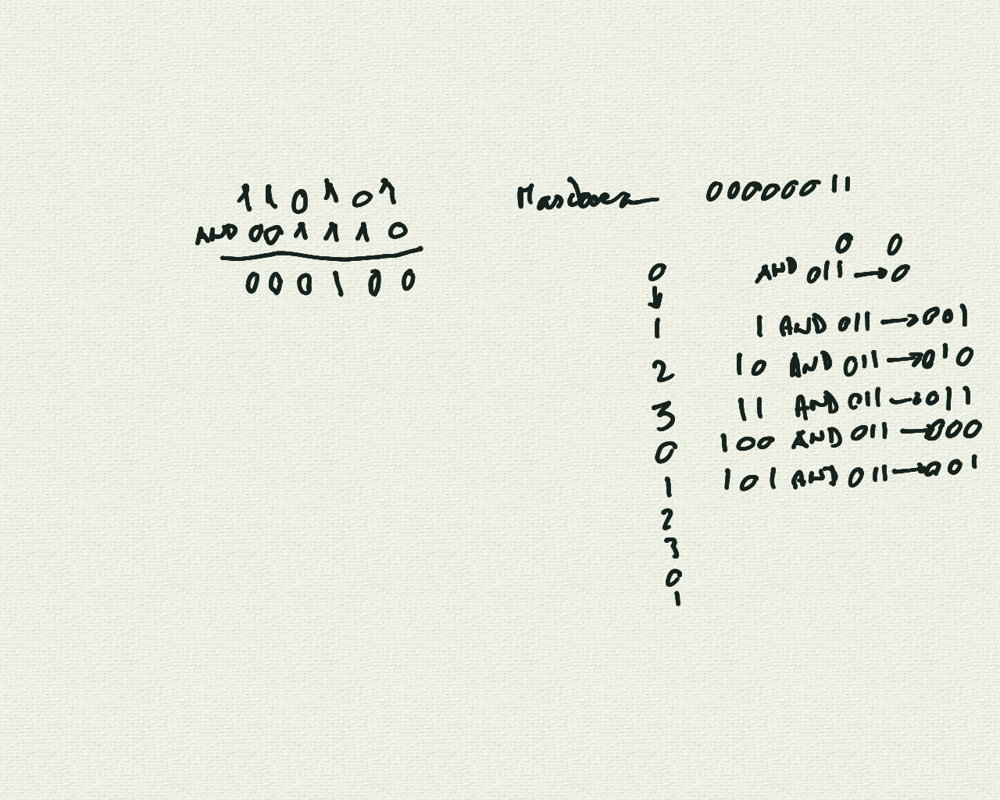
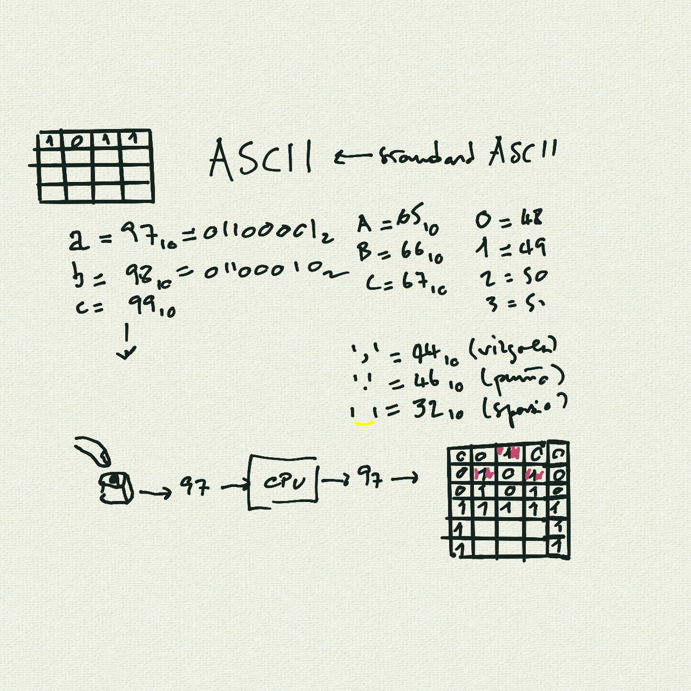

# Corso Propedeutico: lezione del 07/04/2020 (modalità remota)

## Argomenti trattati: **INFORMATICA**

### Introduzione all'informatica

* Il sistema binario
  * risoluzione del sistema binario (importanza della quantità di bit)
  * operazioni binarie:
    * addizioni
    * rappresentazione di numeri negativi (complemento a due)
    * sottrazione
  * operazioni logiche (tavole della verità):
    * AND
    * OR
    * XOR
  * maschere
* lo standard ASCII (introduzione)

## Lavagne

[Lavagna n.1: contare in binario - aritmetica binaria ](./whiteboard_1.png)

[Lavagna n.2: logica booleana ](./whiteboard_2.png)

[Lavagna n.3: maschere e mascheramento ](./whiteboard_3.png)

[Lavagna n.4: lo standard ASCII e la codifica dei caratteri ](./whiteboard_4.png)
