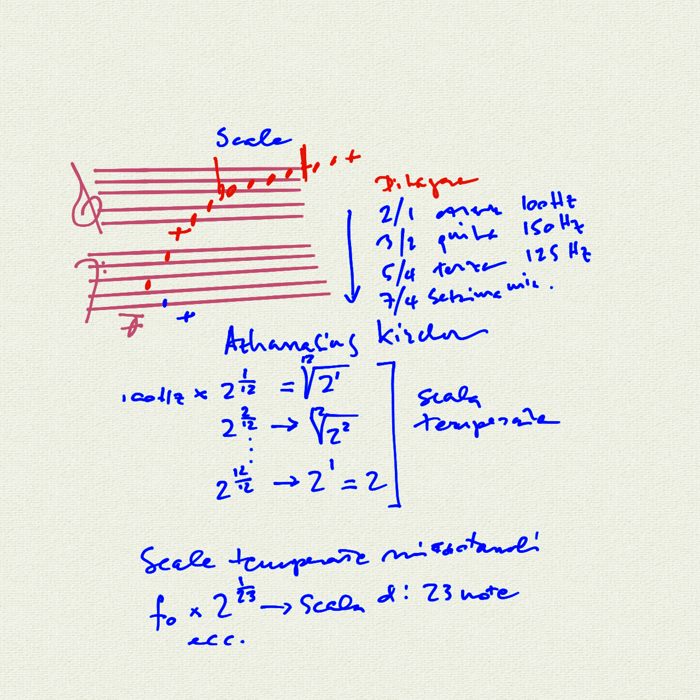

# Corso Propedeutico: lezione del 21/04/2020 (modalità remota)

## Argomenti trattati: **Tecniche Compositive della Musica Contemporanea**

### La dimensione orizzontale

* recupero modale delle scale diatoniche
* altre scale di sette note non-diatoniche
* scale con meno di sette note:
* scale pentatoniche
* scale esatonali
* scale di otto note (ottatoniche)
* scale cromatiche
* scale microtonali
* modi a trasposizioni limitate

### La costruzione delle scale

* scale naturali
* scale pitagoriche
* scale temperate

## Lavagne

