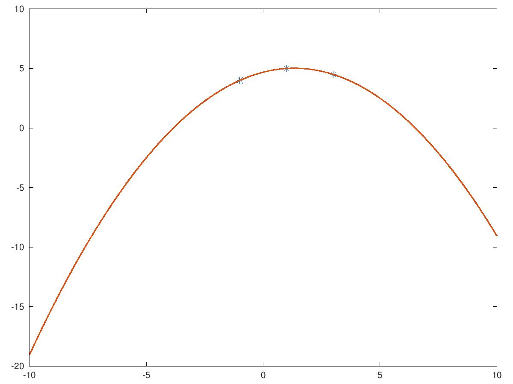
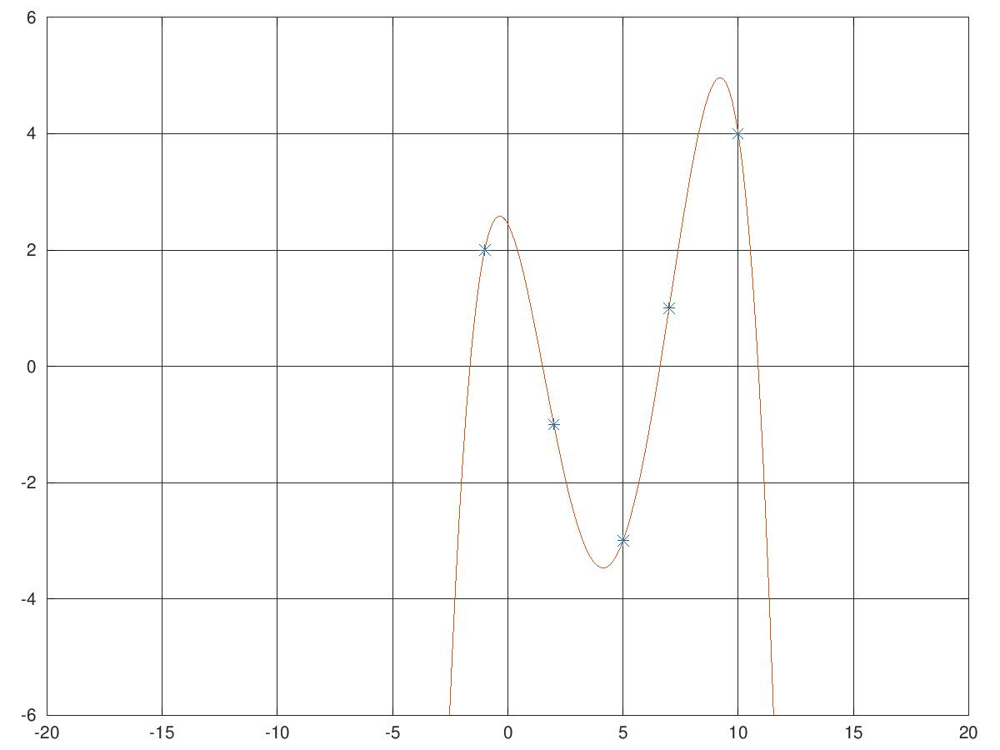

# Corso Propedeutico: lezione del 05/05/2020 (modalità remota)

## Argomenti trattati: **Elementi di Matematica**

### Soluzione di equazioni di ordini superiori

* fitting di curve
* realizzazione alla lavagna
* realizzazione in linguaggio `matlab` con `octave`
  * calcolo dei coefficienti con `polyfit`


#### [Risoluzione di un polinomio di secondo grado (passaggio da 3 punti)](./poly2.m)

```matlab
%
% polinomio di secondo grado
%
y0 = 4;
x0 = -1;

y1 = 4.5;
x1 = 3;

y2 = 5;
x2 = 1;

ycoord = [y0 y1 y2];
xcoord = [x0 x1 x2];

P = polyfit(xcoord, ycoord, 2);

x = [-10:0.01:10];
y = P(1)*(x.**2) + (P(2) * x) + P(3);

plot(xcoord, ycoord, '*', x, y, 'linewidth', 4)
```

Questo codice produce il grafico seguente:



#### [Risoluzione di un polinomio di n-esimo grado (passaggio da n+1 punti)](./poly5.m)

```matlab
xcoord= [-1 2 5 7 10]; 
ycoord= [2 -1 -3 1 4];
P=polyfit (xcoord,ycoord,4);
x=[-3:0.01:12];
y=(P(1)*x.**4)+(P(2)*x.**3)+P(3)*x.**2+P(4)*x+P(5);
plot(xcoord,ycoord,"*",x,y)
grid on 
axis([-20 20 -6 6])
```

Questo codice produce il grafico seguente:



### [Aberrazioni nella risoluzione dei polinomi](./poly52.m)

Il metodo di fitting polinomiale non è perfetto. In particolare ci possono
essere condizioni che fanno "impazzire" il polinomio, come ad esempio una
serie di punti che si trovano tutti su una retta *salvo uno*. Il tentativo di
soluzione polinomiale che si produce è quello che segue.

```matlab
xcoord= [-1 0 1 5 10]; 
ycoord= [-0.5 -7 0.5 2.5 5];
P=polyfit (xcoord,ycoord,4);
x=[-3:0.01:12];
y=(P(1)*x.**4)+(P(2)*x.**3)+P(3)*x.**2+P(4)*x+P(5);
plot(xcoord,ycoord,"*",x,y)
grid on 
axis([-5 15 -20 20])
```

Questo codice produce il grafico seguente:


### Introduzione alle funzioni periodiche

* definizione di funzioni periodiche
  * periodo
  * ampiezza
  * frequenza
* i radianti come unità di misura degli angoli
* funzioni periodiche semplici:
  * funzione *sinusoidale*
  * funzione *cosinusoidale*


