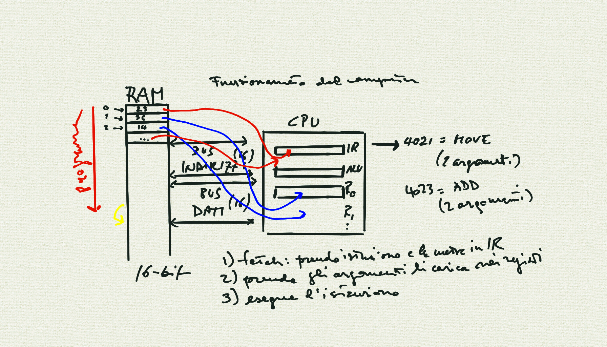
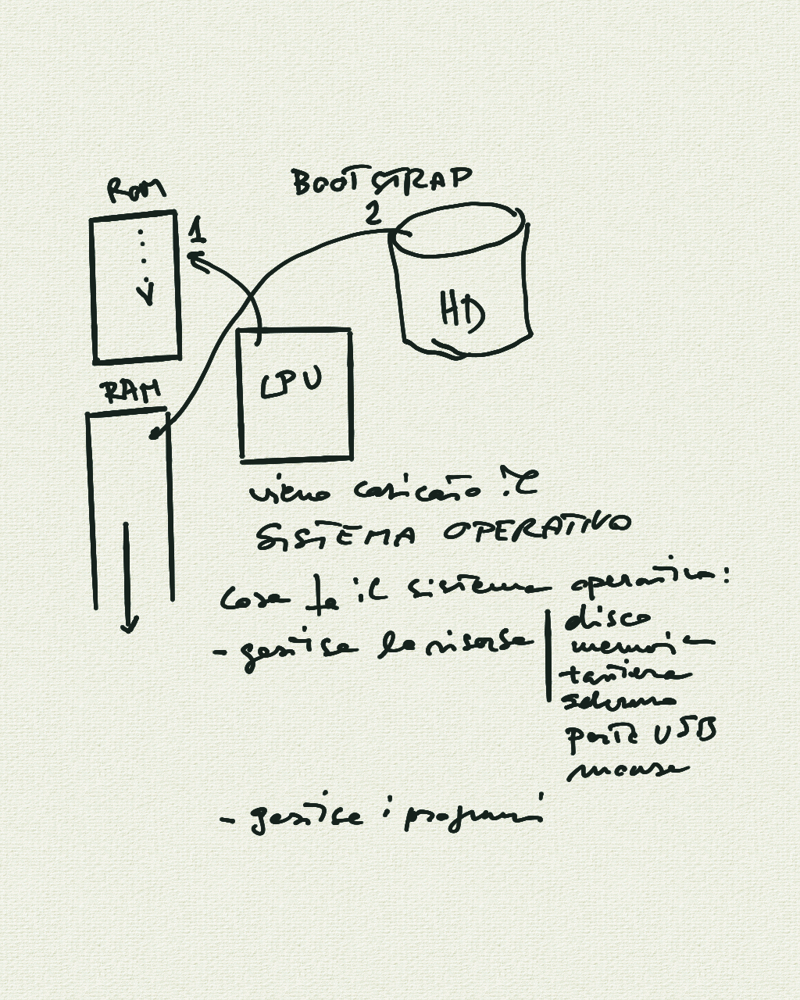
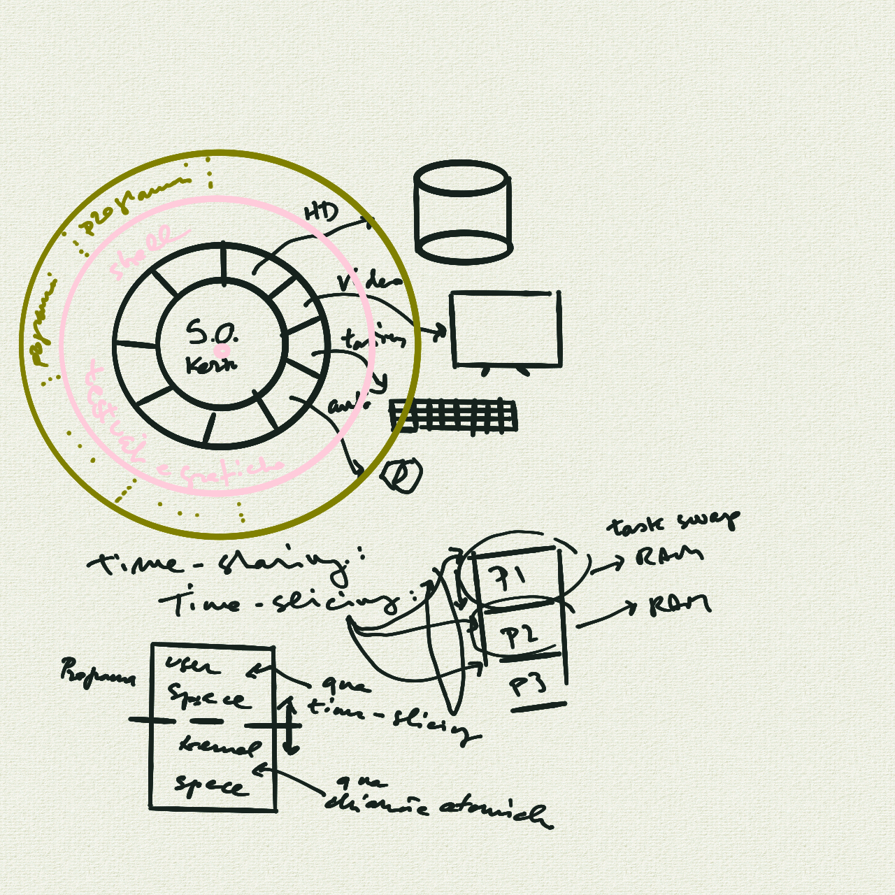

# Corso Propedeutico: lezione del 12/05/2020 (modalità remota)

## Argomenti trattati: **INFORMATICA**

### Introduzione all'informatica

* lo standard ASCII
* Altri set di caratteri (Latin-1, UTF-8)
* Set multi-byte
* come funziona un programma (codice binario)
* la sequenza di *boot*
* la stratificazione del *software*
  * sistema operativo
    * kernel
      * *user space*, *kernel space*
      * *kernel drivers*
      * *outer shell*
    * le applicazioni
    * interazioni applicazioni/kernel
* che cos'è la programmazione:
  * codice macchina
  * *assembly code*
  * linguaggi di alto livello:
    * compilatori
    * interpreti

## Lavagne

### All'interno di un computer



### La sequenza di bootstrap



### Sistemi operativi, layers e multi-tasking



## Codice scritto in classe

### ["Ciao Arturo!" scritto in linguaggio `C` (compilato)](./ciao_arturo.c)

```C
#include <stdio.h>

int main()
{
   puts("Ciao Arturo!");
}
```

Esecuzione:

```sh
$ cc -o ciao_arturo ciao_arturo.c
$ ./ciao_arturo
Ciao Arturo!
```

### ["Ciao Arturo!" scritto in linguaggio `python` (interpretato)](./ciao_arturo.py)

```python
print "Ciao Arturo!"
```

Esecuzione:

```sh
$ python ciao_arturo.py
Ciao Arturo!
```
