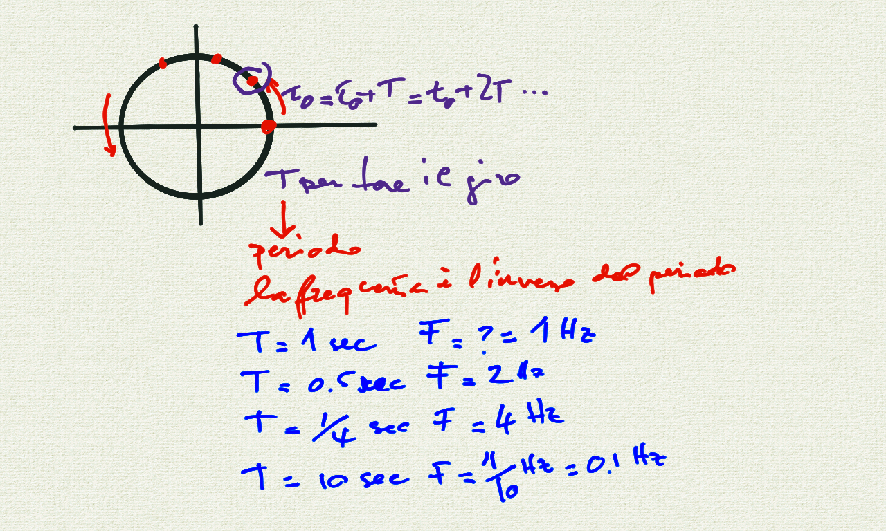
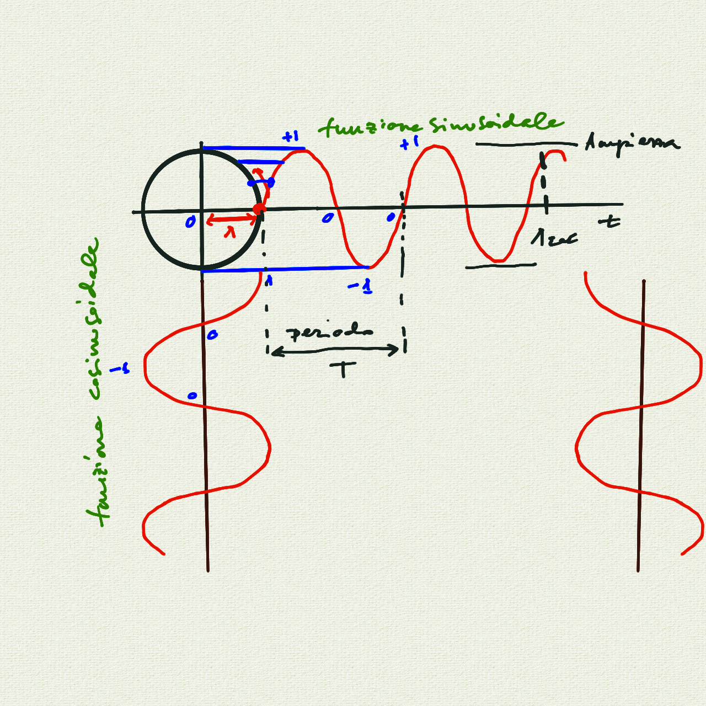
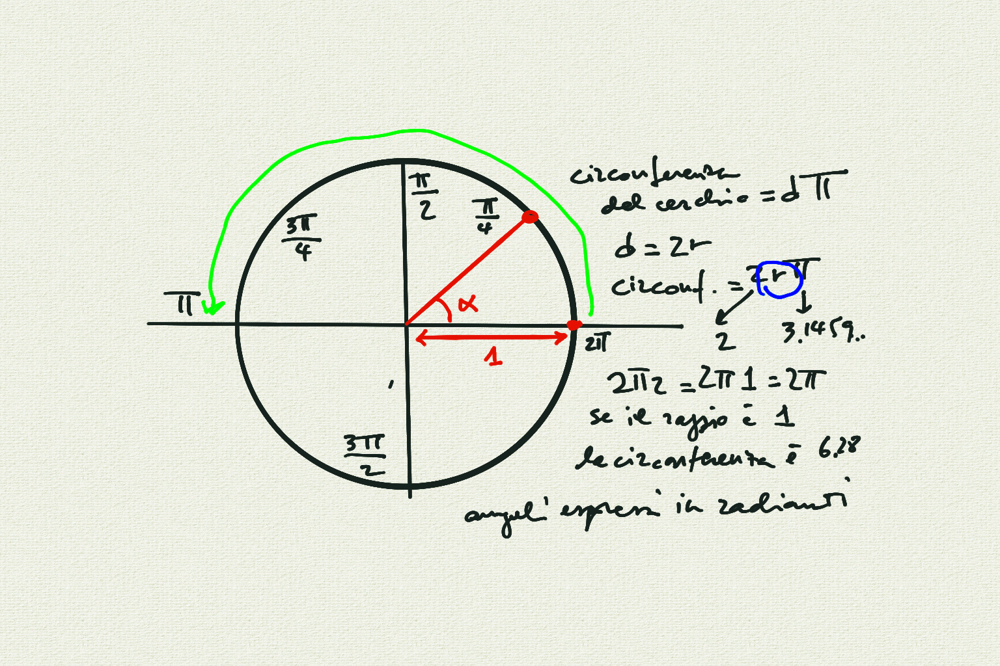
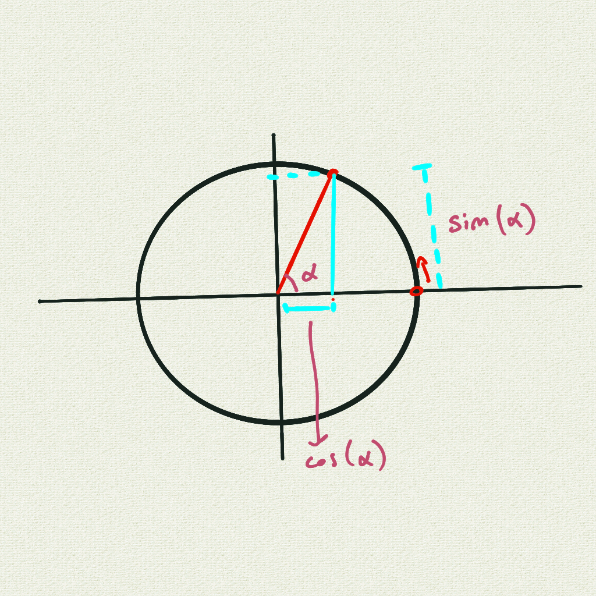
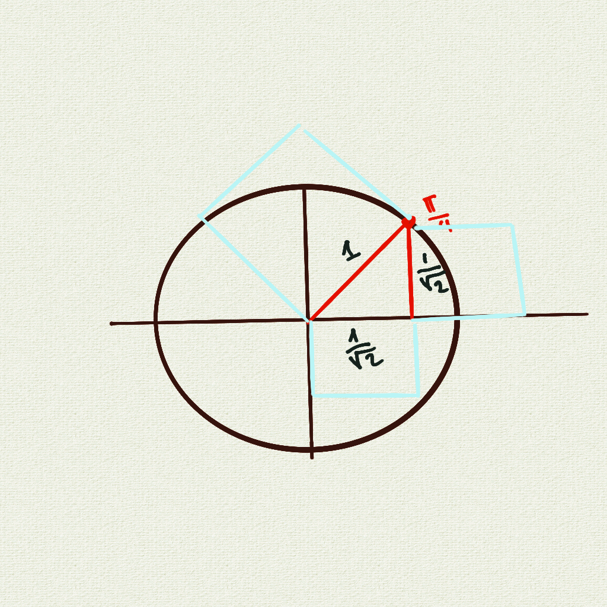
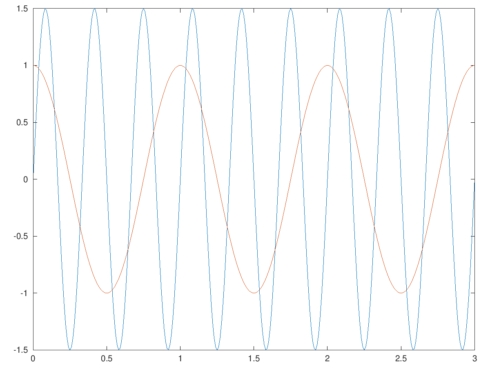

# Corso Propedeutico: lezione del 26/05/2020 (modalità remota)

## Argomenti trattati: **Elementi di Matematica**

### Approfondimento delle funzioni periodiche

* realizzazione `octave` di funzioni periodiche:
  * funzioni sinusoidali
  * funzioni cosinusoidali
* il parametro dell'ampiezza
  * ampiezza costante

### Lavagne











### Codice `octave`

```matlab
t=[0:0.01:3];
freq=3;
amp=1.5;
fs=amp*sin(freq*2*pi*t);
fc=cos(2*pi*t);
plot(t,fs,t,fc);
```

Questo programma produce il grafico seguente:


