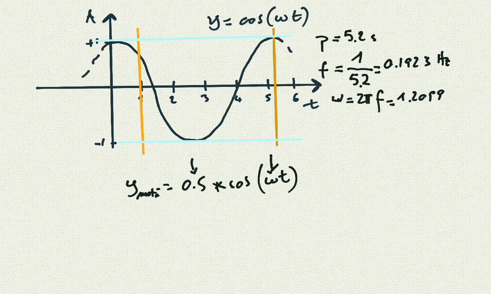
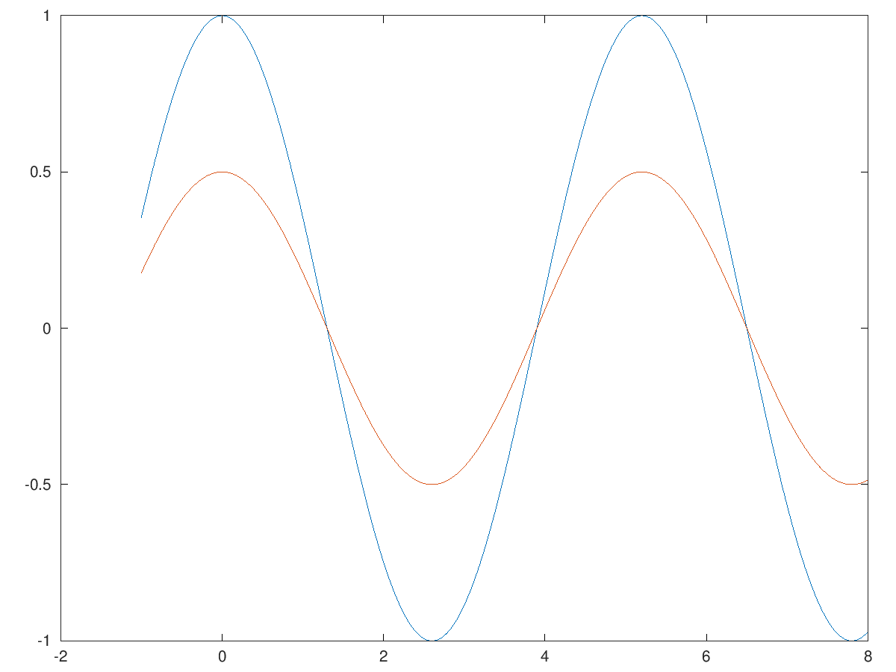
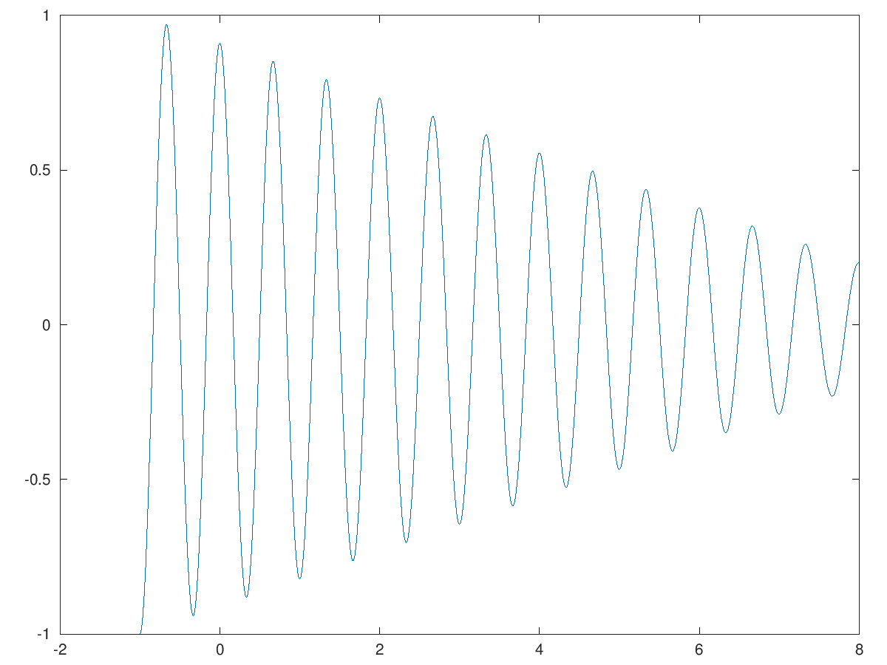
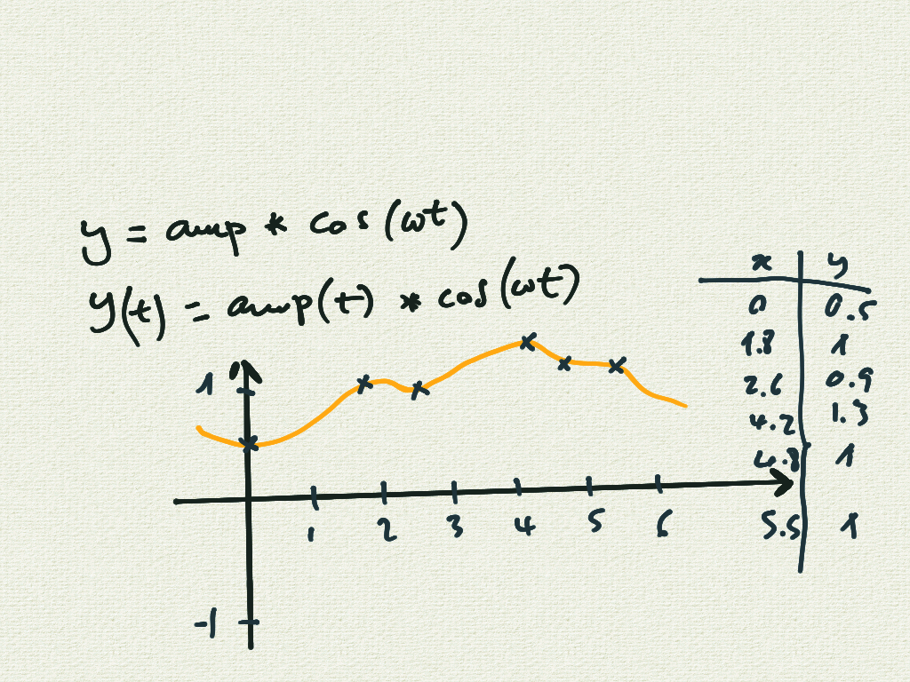
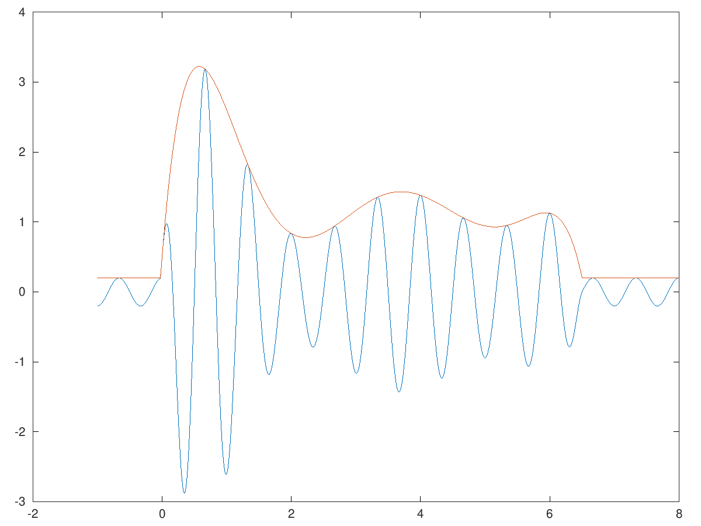
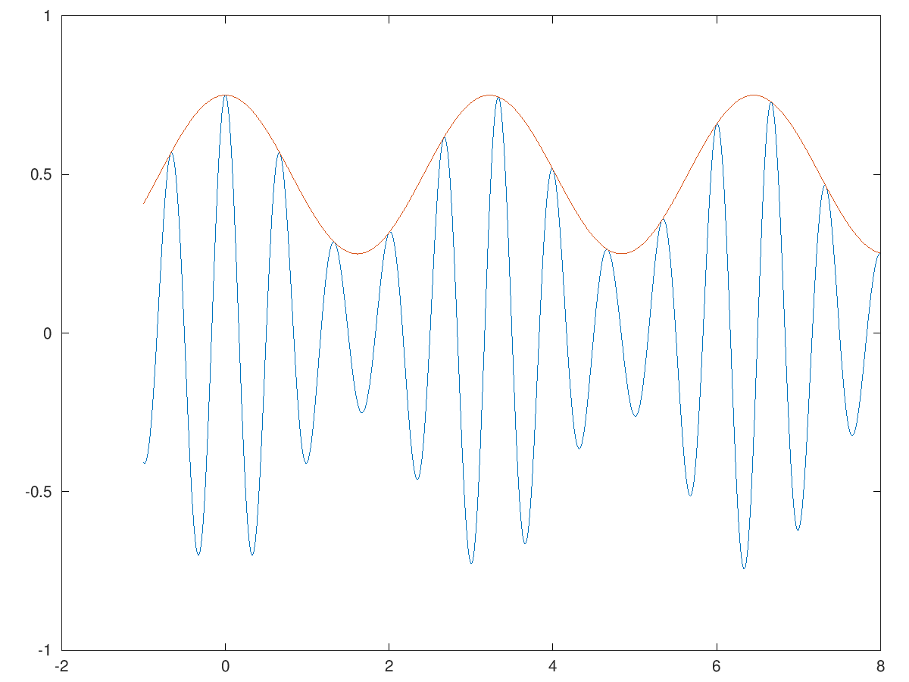

# Corso Propedeutico: lezione del 23/06/2020 (modalità remota)

## Argomenti trattati: **Elementi di Matematica**

### Approfondimento delle funzioni periodiche

* realizzazione `octave` di funzioni periodiche:
* il parametro dell'ampiezza
  * ampiezza variabile
    * variazioni lineari
    * variazioni polinomiali
    * variazioni periodiche

### I parametri delle funzioni periodiche



#### Ampiezze costanti

```matlab
t=[-1:0.01:8];
f=0.1923;
amp0=1;
amp1=0.5;
W=f*2*pi;
y0=amp0*cos(W*t);
y1=amp1*cos(W*t);
plot(t,y0,t,y1)
```

produce il grafico che segue:



#### Ampiezze variabili linearmente

```matlab
t=[-1:0.01:8];
f=1.5;
amp0=1;
amp1=0.2;
amprange=amp1-amp0;
ampstep=amprange/length(t);
amp=[amp0:ampstep:amp1-ampstep];
W=f*2*pi;
y=amp.*cos(W*t);
plot(t,y);
```

produce il grafico che segue:



#### Ampiezze variabili attraverso funzioni polinomiali



```matlab
t=[-1:0.01:8];
xp=[0 1.8 2.6 4.2 4.8 5.5 6.5];
yp=[0.5 1 0.9 1.3 1 1 0.2];
p=polyfit(xp,yp,length(xp)-1);
amp=polyval(p,t);
amp=max(amp,0.2);
f=1.5;
W=f*2*pi;
y=amp.*cos(W*t);
plot(t,y,t,amp);
```

produce il grafico che segue:



#### Ampiezze variabili attraverso funzioni periodiche

```matlab
t=[-1:0.01:8];
ampm=0.25;
ampoffset=1-(2*ampm);
fm=0.31;
Wm=fm*2*pi;
amp=ampm*cos(Wm*t)+ampoffset;
f=1.5;
W=f*2*pi;
y=amp.*cos(W*t);
plot(t,y,t,amp);
```

produce il grafico che segue:


