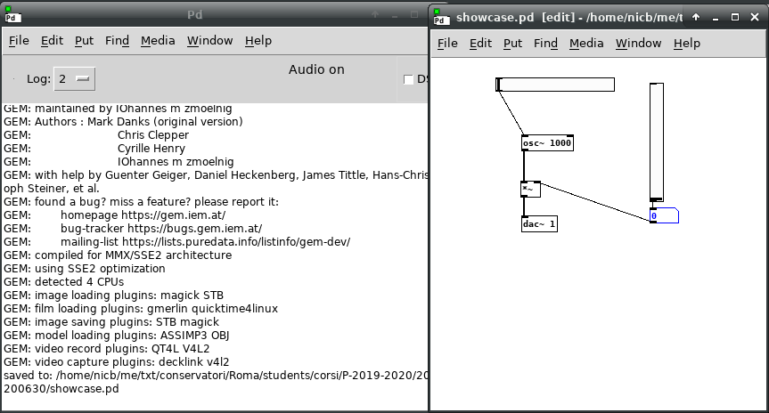
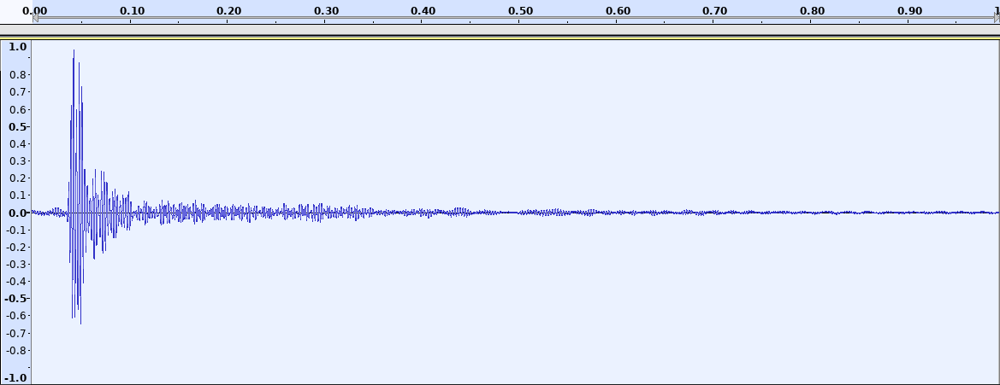
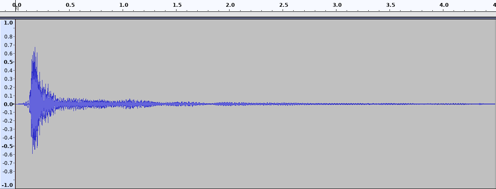

# Corso Propedeutico: lezione del 30/06/2020 (modalità remota)

## Argomenti trattati: **INFORMATICA**

### Introduzione all'informatica

#### La programmazione

* I linguaggi di programmazione
  * programmazione top-down
  * linguaggi strutturati
  * linguaggi object-oriented
* la programmazione
  * cosa significa *programmare*
* applicazioni del mondo dell'informatica musicale
  * tempo reale e tempo differito
  * algoritmi causali e algoritmi non causali
  * compilatori di suoni
  * prototipatori strumentali
  * strumenti didattici

## Esempi

### [Linguaggio compilato (`C`)](./ciao_arturo.c)

```C
#include <stdio.h>

int main()
{
  printf("ciao arturo!\n");

  return 0;
}
```

```sh
$ cc -o ciao_arturo ciao_arturo.c
$ ./ciao_arturo
ciao arturo!
```

Il [codice macchina](./ciao_arturo.s) prodotto (in `assembler`) è:

```gasp
	.file	"ciao_arturo.c"
	.text
	.section	.rodata
.LC0:
	.string	"ciao arturo!"
	.text
	.globl	main
	.type	main, @function
main:
.LFB0:
	.cfi_startproc
	pushq	%rbp
	.cfi_def_cfa_offset 16
	.cfi_offset 6, -16
	movq	%rsp, %rbp
	.cfi_def_cfa_register 6
	leaq	.LC0(%rip), %rdi
	call	puts@PLT
	movl	$0, %eax
	popq	%rbp
	.cfi_def_cfa 7, 8
	ret
	.cfi_endproc
.LFE0:
	.size	main, .-main
	.ident	"GCC: (Debian 8.3.0-6) 8.3.0"
	.section	.note.GNU-stack,"",@progbits
```

### [Linguaggio interpretato (`python`)](./ciao_arturo.py):

```python
print "ciao arturo!"
```

```sh
$ python ciao_arturo.py
ciao arturo!
```

### [Prototipatore strumentale grafico (`puredata`)](./showcase.pd)



### Algoritmo musicale *non-causale*

Esempio: `dilatazione temporale`

[](./011.mp3)

[](./011-stretch.mp3)
